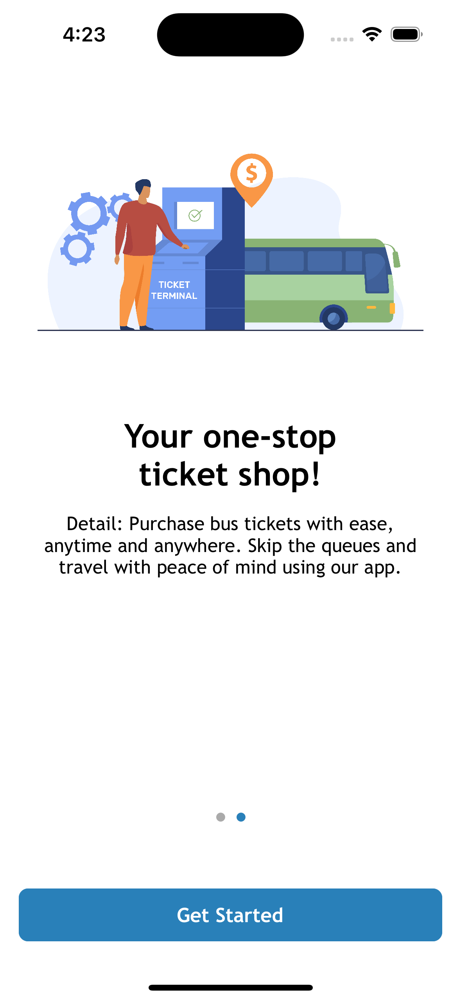
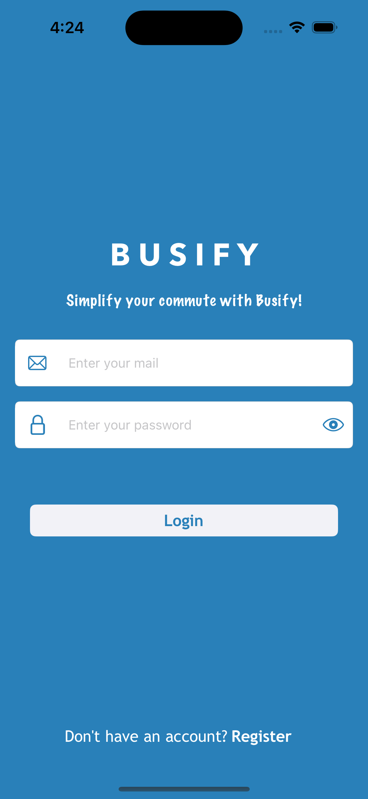
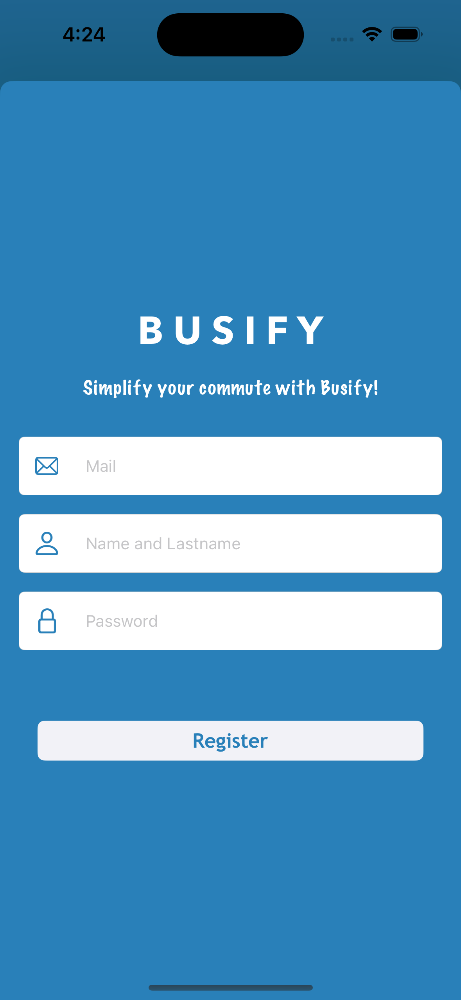
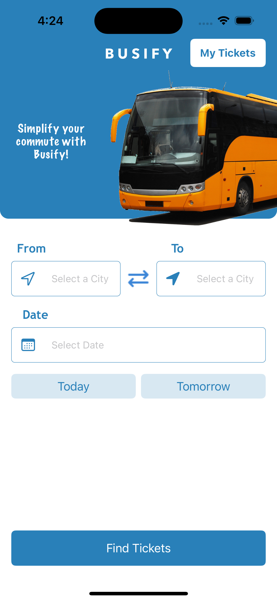
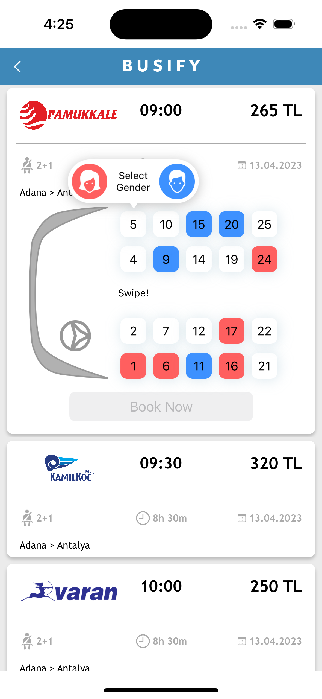
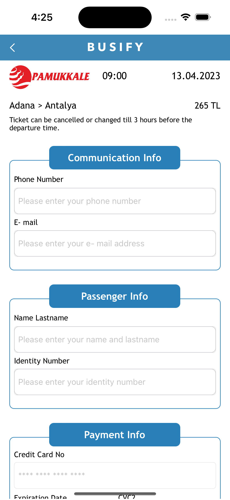

# Busify 🚌 💺

Busify, kullanıcıların online olarak otobüs bileti satın almasına ve seyahat planlarını yönetmelerine olanak tanıyan bir mobil uygulamadır. Uygulama, kullanıcıların seyahat tarihlerini, kalkış ve varış noktalarını seçmelerine, uygun otobüs seferlerini aramalarına ve biletlerini güvenli bir şekilde satın almalarına olanak tanır. Ayrıca, kullanıcılar biletlerini görüntüleyebilir, seyahat planlarını yönetebilirler.

## Uygulama İçi Görüntüler

         

## Kurulum

1. Projeyi klonlayın: `git clone https://github.com/keremersu35/Busify.git`
2. Proje kök dizinine gidin: `cd Busify`
3. Gereksinimleri yükleyin: `pod install`
4. Proje dosyasını Xcode ile açın: `open Busify.xcworkspace`
